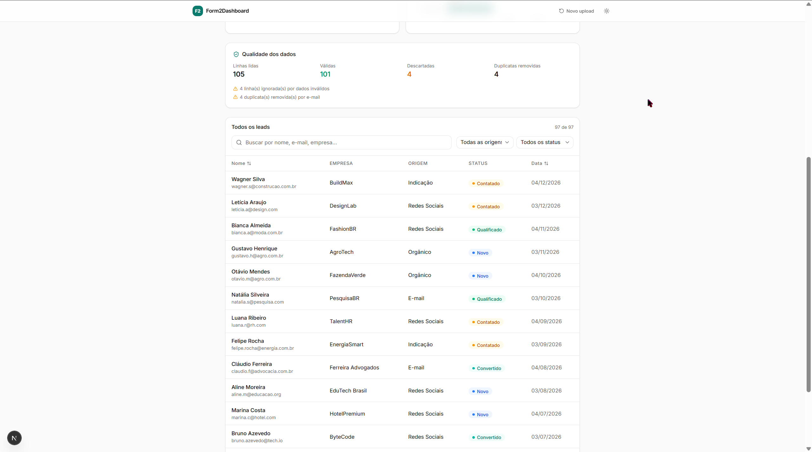
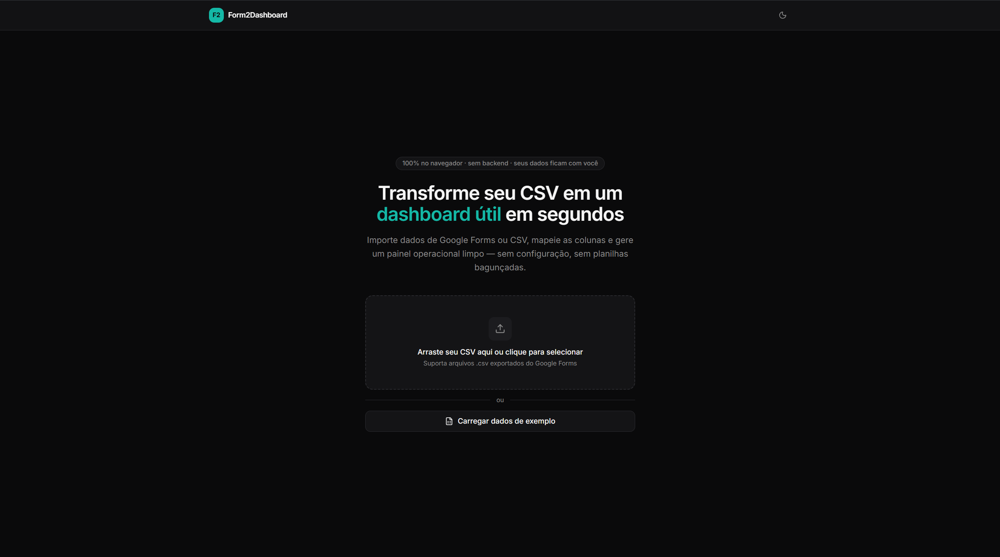
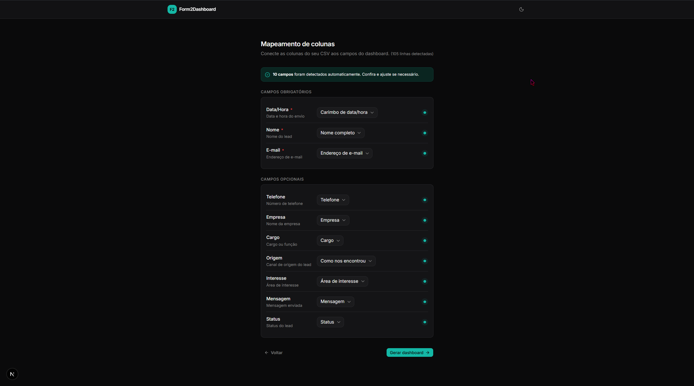
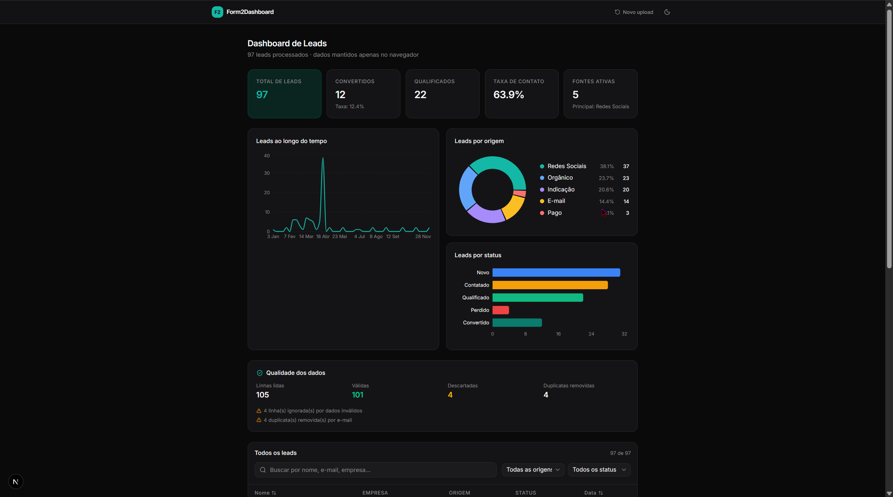

<div align="center">
  

  <h1>Form2Dashboard</h1>
  <p><strong>Take ugly operational data. Get useful clarity in seconds.</strong></p>

  <p>
    <a href="#english">
      
    </a>
    &nbsp;
    <a href="#português">
      
    </a>
  </p>

  <p>
    
    
    
    
    
  </p>
</div>

---

<div align="center">

## Screenshots


<p><em>Clean, drag-and-drop CSV upload interface</em></p>

<br/>


<p><em>Intelligent auto-detection and column mapping</em></p>

<br/>


<p><em>Full dashboard — KPI cards, charts, and filterable table</em></p>

<br/>


<p><em>First-class dark mode support</em></p>

</div>

---

<h2 id="english">🇬🇧 English</h2>

### Overview

**Form2Dashboard** is a premium, client-side operational dashboard that transforms messy CSV exports — such as raw Google Forms responses — into a clean, structured, and highly visual analytics interface.

Real-world operational data is rarely clean. It contains duplicate entries, inconsistent casing, unparseable dates, and missing fields. Form2Dashboard bridges the gap between raw data collection and actionable insight by automatically mapping, validating, and cleaning your datasets before presenting them in a polished interface.

Unlike generic BI tools that demand complex backend integrations, or simple admin templates that lack any data processing logic, Form2Dashboard handles the **entire pipeline inside the user's browser** — no server, no database, no configuration.

> 🔒 **Privacy by design:** Your CSV never leaves your machine. All parsing, validation, and aggregation runs locally in the browser.

### Live Demo

🔗 **[form2dashboard.vercel.app](https://form2dashboard.vercel.app)**

No data? No problem. Click **"Load Demo Data"** on the landing page to instantly populate the dashboard with a realistic 120-row seed dataset.

---

### Features

#### 📥 Data Ingestion
- **Drag & Drop Upload** — animated dropzone with file validation feedback
- **Intelligent Auto-Detection** — guesses column mappings from common header names (`"Nome"`, `"E-mail"`, `"Carimbo de data/hora"`)
- **One-Click Demo** — loads seed data instantly, no upload required

#### 🧹 Validation & Cleaning
- **Required field enforcement** — `timestamp`, `name`, `email` are mandatory; invalid rows are counted and reported
- **Email format validation** — regex-based with friendly per-row error messages
- **Date parsing** — accepts ISO 8601, `DD/MM/YYYY`, and `MM/DD/YYYY`; unrecognizable formats generate errors
- **Smart deduplication** — detects duplicate emails, keeps the most recent entry, reports count
- **Graceful status normalization** — unknown status values are mapped to `"novo"` with a warning

#### 📊 KPI Metrics
| Metric | Description |
|---|---|
| **Total Leads** | Valid, deduplicated lead count |
| **Converted** | Leads with status `convertido` |
| **Conversion Rate** | Converted ÷ Total × 100% |
| **Qualified** | Leads with status `qualificado` or `convertido` |
| **Active Sources** | Distinct acquisition channels in the dataset |

#### 📈 Visualizations
- **Leads Over Time** — Area chart with weekly/monthly auto-scale
- **Source Distribution** — Donut chart by acquisition channel
- **Pipeline Status** — Horizontal bar chart across funnel stages

#### 📋 Interactive Table
- Global search across name, email, and company
- Multi-select filter by Source; single-select filter by Status
- Sortable columns, paginated (25 rows/page)
- Data Quality callout: valid %, duplicates removed, rows skipped

#### ✨ UX Details
- System-aware dark/light mode with manual toggle
- Skeleton loaders on all data-dependent views
- Designed empty, error, and loading states for every screen
- Fully responsive from 375px mobile to ultrawide

---

### Data Flow

```
[ CSV Drop ] → [ PapaParse ] → [ Column Mapper ] → [ Validator ] → [ Cleaner ] → [ Aggregator ] → [ Dashboard ]
```

| Step | File | Responsibility |
|---|---|---|
| Parse | `lib/parser.ts` | CSV string → raw `Record<string, string>[]` |
| Map | `components/mapping/` | User assigns CSV columns to domain fields |
| Validate | `lib/validator.ts` | Required fields, email regex, date parsing, dedup |
| Clean | `lib/cleaner.ts` | Normalize dates, strings, source aliases |
| Aggregate | `lib/aggregator.ts` | KPIs, time series, category breakdowns |
| Render | `components/dashboard/` | Recharts + TanStack Table |

---

### Tech Stack

| Layer | Technology |
|---|---|
| Framework | Next.js 15 (App Router) |
| Language | TypeScript (strict) |
| Styling | Tailwind CSS + shadcn/ui |
| State | Zustand |
| Charts | Recharts |
| Table | TanStack Table v8 |
| CSV Parsing | PapaParse |
| Icons | Lucide React |
| CI/CD | GitHub Actions |
| Hosting | Vercel |

---

### Project Structure

```
form2dashboard/
├── .github/workflows/ci.yml       # Lint + typecheck on every PR
├── public/
│   ├── og-image.png               # Open Graph banner
│   ├── screenshots/               # README assets
│   └── seed/leads-operacionais.csv
├── src/
│   ├── app/                       # Next.js pages & layout
│   ├── components/
│   │   ├── dashboard/             # KPI cards, charts, quality badge
│   │   ├── layout/                # Header, sidebar, wrappers
│   │   ├── mapping/               # Column mapper UI
│   │   ├── table/                 # Data table + filters + pagination
│   │   ├── ui/                    # shadcn/ui primitives
│   │   └── upload/                # Drag & drop dropzone
│   ├── config/                    # Labels, aliases, constants
│   ├── lib/                       # Core processing pipeline
│   │   ├── aggregator.ts
│   │   ├── cleaner.ts
│   │   ├── parser.ts
│   │   ├── utils.ts
│   │   └── validator.ts
│   ├── store/app-store.ts         # Zustand store
│   └── types/                     # Domain interfaces
└── README.md
```

---

### Getting Started

**Prerequisites:** Node.js 18+ · npm or pnpm

```bash
git clone https://github.com/BarujaFe1/Form2Dashboard.git
cd Form2Dashboard
npm install
npm run dev
```

Open [http://localhost:3000](http://localhost:3000).

**Using your own data**
1. Export your Google Forms responses as CSV (Responses → Download CSV)
2. Drop the file on the upload screen
3. Map your columns to the required fields
4. Your dashboard is ready

**Using demo data:** Click **"Load Demo Data"** on the landing page. The seed file is also available at `public/seed/leads-operacionais.csv`.

---

### Seed Dataset

`leads-operacionais.csv` is engineered to stress-test every part of the pipeline:

- **120 rows** of realistic Brazilian B2B lead data
- **3 months** of timestamps (Jan–Mar 2025) for meaningful chart trends
- **All 5 pipeline statuses** represented proportionally
- **8 acquisition channels** for a rich source distribution
- **Intentional anomalies:** 3 duplicate emails, 6 rows with invalid/missing data

---

### Validation Rules

| Rule | Behavior | Message |
|---|---|---|
| Required field empty | Row skipped | `Linha [X]: Campo obrigatório ausente: [field]` |
| Invalid email format | Row skipped | `Linha [X]: E-mail inválido: [value]` |
| Unparseable date | Row skipped | `Linha [X]: Data inválida no campo timestamp` |
| Duplicate email | Most recent kept | Warning in Data Quality card |
| Unknown status value | Normalized to `"novo"` | Warning in Data Quality card |
| Empty CSV file | Upload blocked | `O arquivo CSV está vazio.` |

---

### Data Schema

```typescript
type LeadStatus = 'novo' | 'contatado' | 'qualificado' | 'perdido' | 'convertido'
type LeadSource = 'orgânico' | 'pago' | 'indicação' | 'redes_sociais' | 'email' | 'outro'

interface Lead {
  id: string          // generated on parse
  timestamp: Date     // required
  name: string        // required
  email: string       // required — deduplication key
  phone?: string
  company?: string
  role?: string
  source: LeadSource  // defaults to 'outro' if unrecognized
  interest?: string
  message?: string
  status: LeadStatus  // defaults to 'novo' if unrecognized
}
```

---

### Roadmap

| Version | Status | Scope |
|---|---|---|
| **V1.0** | ✅ Shipped | Upload · mapping · validation · cleaning · full dashboard |
| **V1.1** | 🔜 Next | CSV export · advanced filters · improved auto-mapping |
| **V2.0** | 💡 Planned | Google Sheets URL import · simple alert thresholds · second template |

---

### Contributing

```bash
git checkout -b feature/your-feature
git commit -m 'feat: describe your change'
git push origin feature/your-feature
# then open a Pull Request
```

---

### License

MIT — see [LICENSE](./LICENSE).

---

### Author

**Felipe Baruja** — Product Engineer · Data & Automation
[LinkedIn](https://www.linkedin.com/in/barujafe) · [GitHub](https://github.com/BarujaFe1)

---

<br/>
<br/>

---

<h2 id="português">🇧🇷 Português</h2>

### Visão Geral

**Form2Dashboard** é um painel operacional client-side que transforma exportações de CSV bagunçadas — como respostas brutas do Google Forms — em uma interface analítica limpa, estruturada e visualmente clara.

Dados operacionais do mundo real raramente são organizados. Eles contêm registros duplicados, capitalização inconsistente, datas não reconhecíveis e campos ausentes. O Form2Dashboard preenche a lacuna entre a coleta de dados brutos e o insight acionável, mapeando, validando e limpando automaticamente seu dataset antes de apresentá-lo em uma interface polida.

Diferente de ferramentas de BI genéricas que exigem integrações com backend complexo, ou de templates de admin que não têm nenhuma lógica de processamento, o Form2Dashboard executa **todo o pipeline no browser do usuário** — sem servidor, sem banco de dados, sem configuração.

> 🔒 **Privacidade por design:** o seu CSV nunca sai do seu computador. Todo o parse, validação e agregação roda localmente no browser.

### Demo ao vivo

🔗 **[form2dashboard.vercel.app](https://form2dashboard.vercel.app)**

Não tem dados? Sem problema. Clique em **"Carregar Dados de Demonstração"** na tela inicial para popular o painel instantaneamente com um seed dataset de 120 linhas realistas.

---

### Funcionalidades

#### 📥 Ingestão de Dados
- **Upload por Drag & Drop** — dropzone animada com feedback de validação do arquivo
- **Detecção Automática Inteligente** — infere o mapeamento de colunas a partir de nomes de cabeçalho comuns (`"Nome"`, `"E-mail"`, `"Carimbo de data/hora"`)
- **Demo com Um Clique** — carrega o seed data instantaneamente, sem necessidade de upload

#### 🧹 Validação e Limpeza
- **Campos obrigatórios** — `timestamp`, `name`, `email` são obrigatórios; linhas inválidas são contadas e reportadas
- **Validação de e-mail** — regex com mensagens de erro amigáveis por linha
- **Parse de datas** — aceita ISO 8601, `DD/MM/AAAA` e `MM/DD/AAAA`; formatos não reconhecidos geram erro
- **Deduplicação inteligente** — detecta e-mails duplicados, mantém o registro mais recente, reporta a contagem
- **Normalização de status** — valores de status desconhecidos são mapeados para `"novo"` com aviso

#### 📊 Métricas KPI
| Métrica | Descrição |
|---|---|
| **Total de Leads** | Contagem válida e deduplicada |
| **Convertidos** | Leads com status `convertido` |
| **Taxa de Conversão** | Convertidos ÷ Total × 100% |
| **Qualificados** | Leads com status `qualificado` ou `convertido` |
| **Origens Ativas** | Canais de aquisição distintos no dataset |

#### 📈 Visualizações
- **Leads ao Longo do Tempo** — Area chart com escala semanal/mensal automática
- **Distribuição por Origem** — Donut chart por canal de aquisição
- **Status do Pipeline** — Gráfico de barras horizontais por estágio do funil

#### 📋 Tabela Interativa
- Busca global por nome, e-mail e empresa
- Filtro multi-select por Origem; filtro single-select por Status
- Colunas ordenáveis, paginação (25 linhas/página)
- Callout de Qualidade de Dados: % válidos, duplicatas removidas, linhas ignoradas

#### ✨ Detalhes de UX
- Dark/light mode com detecção de preferência do sistema e toggle manual
- Skeleton loaders em todas as views com dados
- Estados de vazio, erro e carregamento para todas as telas
- Responsivo de 375px (mobile) até monitores ultrawide

---

### Fluxo de Dados

```
[ Upload CSV ] → [ PapaParse ] → [ Mapeador de Colunas ] → [ Validador ] → [ Limpeza ] → [ Agregação ] → [ Painel ]
```

| Etapa | Arquivo | Responsabilidade |
|---|---|---|
| Parse | `lib/parser.ts` | String CSV → `Record<string, string>[]` bruto |
| Mapeamento | `components/mapping/` | Usuário associa colunas CSV aos campos do domínio |
| Validação | `lib/validator.ts` | Campos obrigatórios, regex de e-mail, parse de data, dedup |
| Limpeza | `lib/cleaner.ts` | Normaliza datas, strings, aliases de origem |
| Agregação | `lib/aggregator.ts` | KPIs, séries temporais, breakdowns por categoria |
| Renderização | `components/dashboard/` | Recharts + TanStack Table |

---

### Stack Técnico

| Camada | Tecnologia |
|---|---|
| Framework | Next.js 15 (App Router) |
| Linguagem | TypeScript (strict) |
| Estilização | Tailwind CSS + shadcn/ui |
| Estado | Zustand |
| Gráficos | Recharts |
| Tabela | TanStack Table v8 |
| Parse de CSV | PapaParse |
| Ícones | Lucide React |
| CI/CD | GitHub Actions |
| Hospedagem | Vercel |

---

### Estrutura do Projeto

```
form2dashboard/
├── .github/workflows/ci.yml       # Lint + typecheck em todo PR
├── public/
│   ├── og-image.png               # Banner Open Graph
│   ├── screenshots/               # Assets do README
│   └── seed/leads-operacionais.csv
├── src/
│   ├── app/                       # Páginas e layout Next.js
│   ├── components/
│   │   ├── dashboard/             # Cards KPI, gráficos, badge de qualidade
│   │   ├── layout/                # Header, sidebar, wrappers
│   │   ├── mapping/               # UI do mapeador de colunas
│   │   ├── table/                 # Tabela + filtros + paginação
│   │   ├── ui/                    # Primitivos shadcn/ui
│   │   └── upload/                # Dropzone drag & drop
│   ├── config/                    # Labels, aliases, constantes
│   ├── lib/                       # Pipeline central de processamento
│   │   ├── aggregator.ts
│   │   ├── cleaner.ts
│   │   ├── parser.ts
│   │   ├── utils.ts
│   │   └── validator.ts
│   ├── store/app-store.ts         # Zustand store
│   └── types/                     # Interfaces do domínio
└── README.md
```

---

### Como Começar

**Pré-requisitos:** Node.js 18+ · npm ou pnpm

```bash
git clone https://github.com/BarujaFe1/Form2Dashboard.git
cd Form2Dashboard
npm install
npm run dev
```

Abra [http://localhost:3000](http://localhost:3000).

**Usando seus próprios dados**
1. Exporte as respostas do seu Google Forms como CSV (Respostas → Baixar CSV)
2. Arraste o arquivo para a tela de upload
3. Mapeie suas colunas para os campos obrigatórios
4. Seu painel está pronto

**Usando dados de demonstração:** Clique em **"Carregar Dados de Demonstração"** na tela inicial. O arquivo seed também está disponível em `public/seed/leads-operacionais.csv`.

---

### Seed Dataset

`leads-operacionais.csv` foi projetado para testar cada parte do pipeline:

- **120 linhas** de dados realistas de leads B2B brasileiros
- **3 meses** de timestamps (Jan–Mar 2025) para tendências de gráfico significativas
- **Todos os 5 status do pipeline** representados proporcionalmente
- **8 canais de aquisição** para uma distribuição de origem rica
- **Anomalias intencionais:** 3 e-mails duplicados, 6 linhas com dados inválidos/ausentes

---

### Regras de Validação

| Regra | Comportamento | Mensagem |
|---|---|---|
| Campo obrigatório vazio | Linha ignorada | `Linha [X]: Campo obrigatório ausente: [campo]` |
| Formato de e-mail inválido | Linha ignorada | `Linha [X]: E-mail inválido: [valor]` |
| Data não reconhecível | Linha ignorada | `Linha [X]: Data inválida no campo timestamp` |
| E-mail duplicado | Mantém o mais recente | Aviso no card de Qualidade de Dados |
| Status desconhecido | Normalizado para `"novo"` | Aviso no card de Qualidade de Dados |
| CSV vazio | Upload bloqueado | `O arquivo CSV está vazio.` |

---

### Schema de Dados

```typescript
type LeadStatus = 'novo' | 'contatado' | 'qualificado' | 'perdido' | 'convertido'
type LeadSource = 'orgânico' | 'pago' | 'indicação' | 'redes_sociais' | 'email' | 'outro'

interface Lead {
  id: string          // gerado no parse
  timestamp: Date     // obrigatório
  name: string        // obrigatório
  email: string       // obrigatório — chave de deduplicação
  phone?: string
  company?: string
  role?: string
  source: LeadSource  // default 'outro' se não reconhecido
  interest?: string
  message?: string
  status: LeadStatus  // default 'novo' se não reconhecido
}
```

---

### Roadmap

| Versão | Status | Escopo |
|---|---|---|
| **V1.0** | ✅ Lançado | Upload · mapeamento · validação · limpeza · painel completo |
| **V1.1** | 🔜 Próximo | Export CSV · filtros avançados · mapeamento automático melhorado |
| **V2.0** | 💡 Planejado | Import via URL do Google Sheets · alertas simples · segundo template |

---

### Contribuindo

```bash
git checkout -b feature/sua-feature
git commit -m 'feat: descreva sua mudança'
git push origin feature/sua-feature
# depois abra um Pull Request
```

---

### Licença

MIT — veja [LICENSE](./LICENSE).

---

### Autor

**Felipe Baruja** — Product Engineer · Data & Automation
[LinkedIn](https://www.linkedin.com/in/barujafe) · [GitHub](https://github.com/BarujaFe1)

---

### Agradecimentos

Obrigado às ferramentas open-source que tornam isso possível:
[Next.js](https://nextjs.org/) · [shadcn/ui](https://ui.shadcn.com/) · [Recharts](https://recharts.org/) · [TanStack Table](https://tanstack.com/table) · [PapaParse](https://www.papaparse.com/) · [Zustand](https://github.com/pmndrs/zustand)

